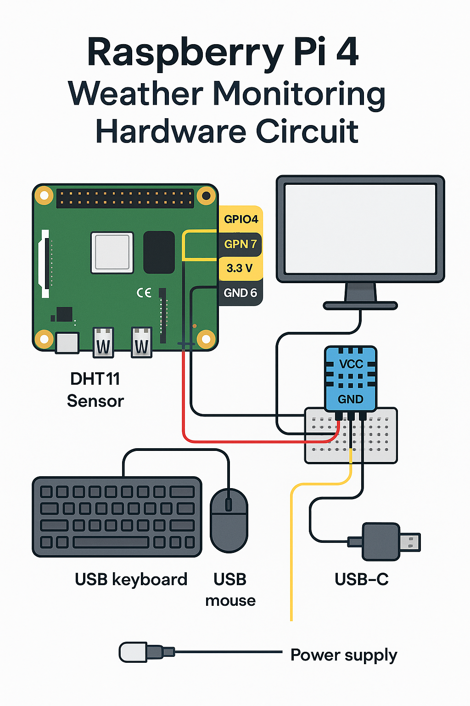
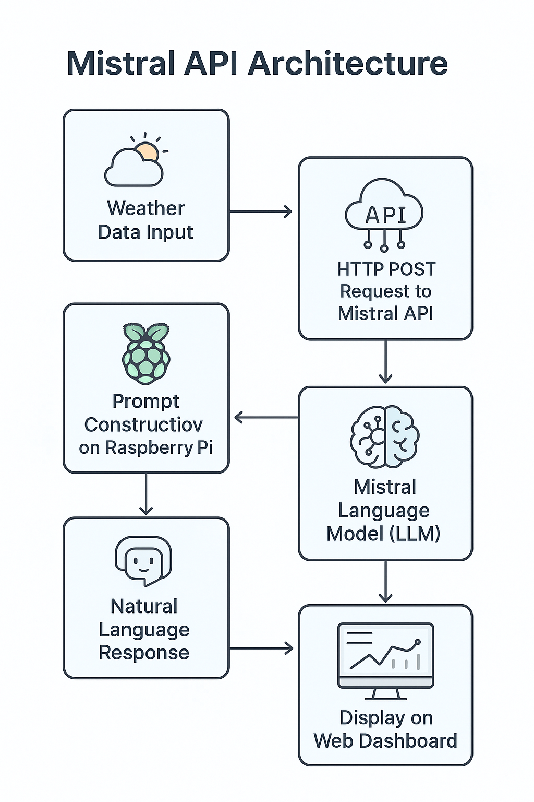
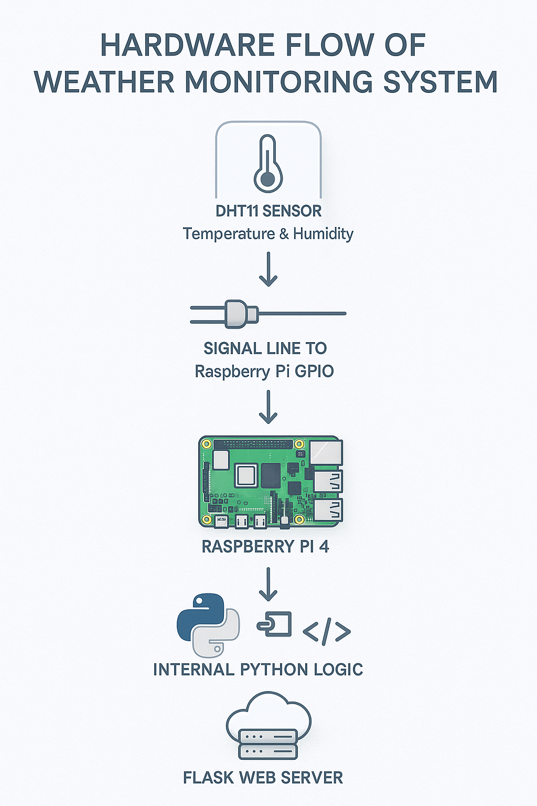
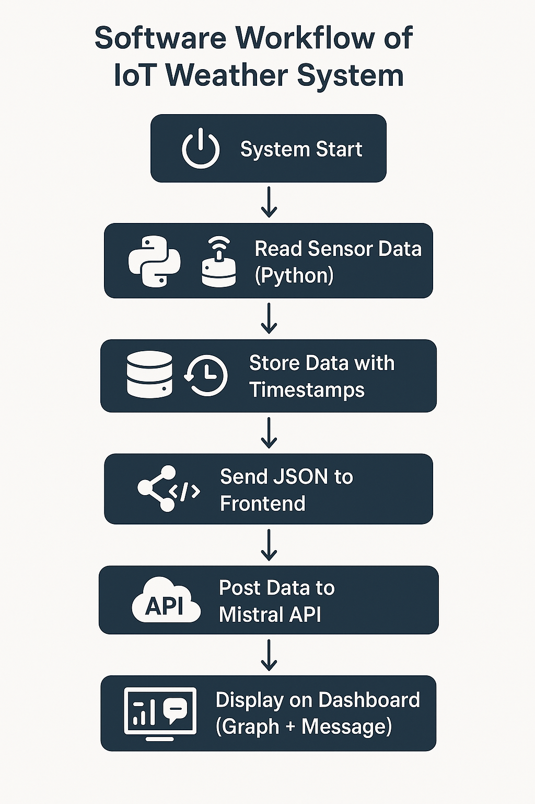

````markdown
# Weather & Chat Dashboard

🌫️ A real-time weather monitoring dashboard with temperature and humidity graphs using a DHT11 sensor on a Raspberry Pi, integrated with a chat interface powered by Mistral AI.

---

## Features

- Live temperature and humidity charts updated every 15 seconds
- Historical data table for recent sensor readings
- Interactive chat interface to ask weather-related questions using the Mistral API
- Responsive, dark-themed UI built with HTML, CSS, and Chart.js
- Backend powered by Flask, reading from DHT11 sensor via Adafruit CircuitPython libraries

---

## Hardware Setup

- Raspberry Pi (any model with GPIO pins)
- DHT11 Temperature and Humidity Sensor connected to GPIO4 (Pin 7)
- Proper wiring following [Adafruit DHT11 guide](https://learn.adafruit.com/dht)

---

## Diagrams

### 1. Hardware Circuit Diagram  


### 2. API Structure  


### 3. Hardware Workflow of Weather Monitoring System  


### 4. Software Workflow of IoT System  


---

## Installation

1. Clone this repository:

   ```bash
   git clone https://github.com/<your-github-username>/weather-chat-dashboard.git
   cd weather-chat-dashboard
````

2. (Optional but recommended) Create and activate a Python virtual environment:

   ```bash
   python3 -m venv venv
   source venv/bin/activate
   ```

3. Install dependencies:

   ```bash
   pip install -r requirements.txt
   ```

4. Update the Mistral API key in `app.py`:

   ```python
   MISTRAL_API_KEY = "your_api_key_here"
   ```

---

## Usage

Run the Flask app:

```bash
python app.py
```

Open your browser at `http://<raspberry-pi-ip>:5050`

* View real-time weather data on the **Dashboard** tab
* Chat with the AI assistant about the weather on the **Chat** tab

---

## Project Structure

```
weather-chat-dashboard/
├── diagrams/
│   ├── api_structure.png
│   ├── hardware_circuit_diagram.png
│   ├── hardware_workflow_weather_monitoring.png
│   └── software_workflow_iot_system.png
├── templates/
│   └── index.html
├── static/
│   ├── style.css
│   └── script.js
├── app.py
├── requirements.txt
└── README.md
```

---

## Notes

* Ensure your Raspberry Pi has the necessary permissions and libraries to read from GPIO.
* The sensor data updates every 15 seconds and retains the last 30 readings.
* Chat uses the Mistral medium model API; ensure you have internet access.

---

## License

This project is licensed under the MIT License. See the [LICENSE](LICENSE) file for details.

---

## Acknowledgments

* [Adafruit CircuitPython DHT library](https://github.com/adafruit/Adafruit_CircuitPython_DHT)
* [Chart.js](https://www.chartjs.org/)
* [Mistral AI](https://mistral.ai/)

---

Feel free to open issues or contribute!

---

*Developed by Your Name*
Jaleed Ahmad

````

---


---

