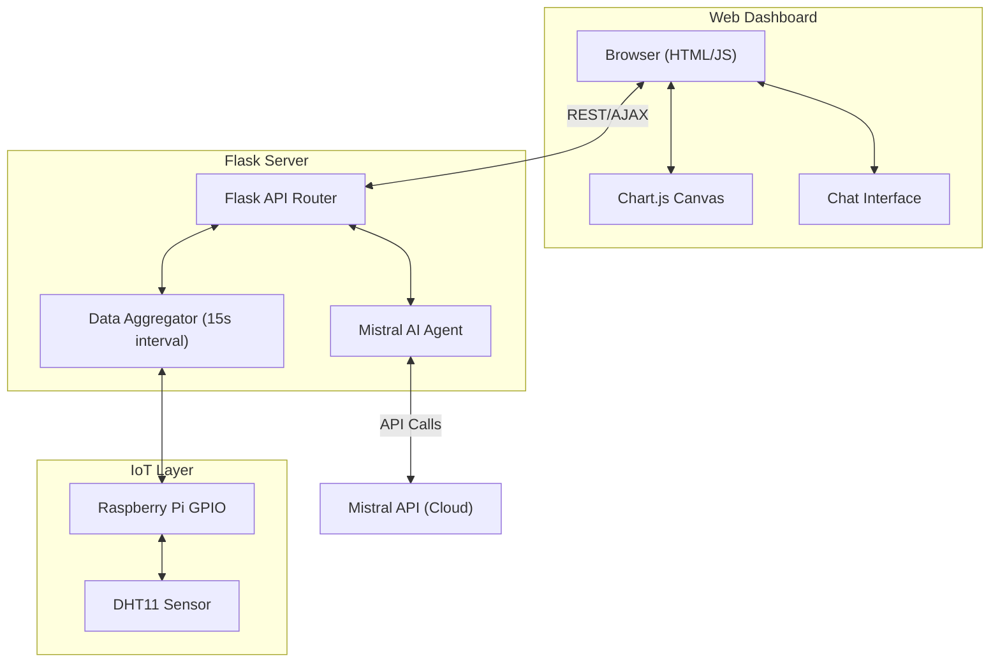
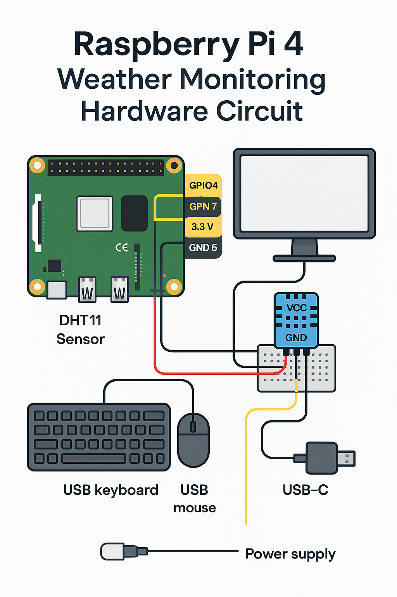
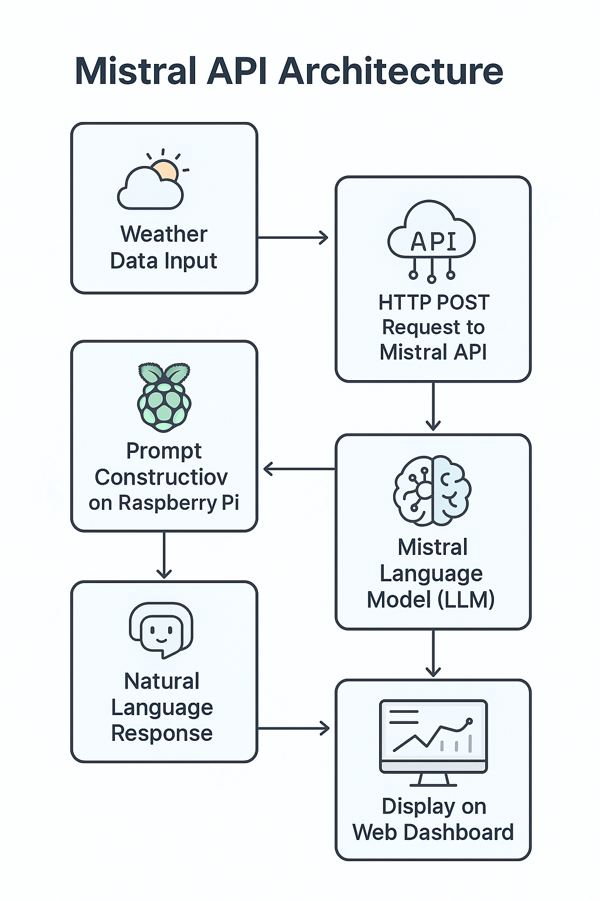
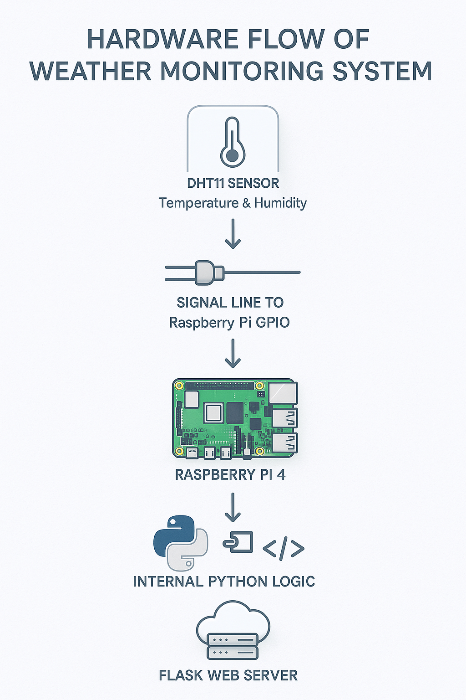
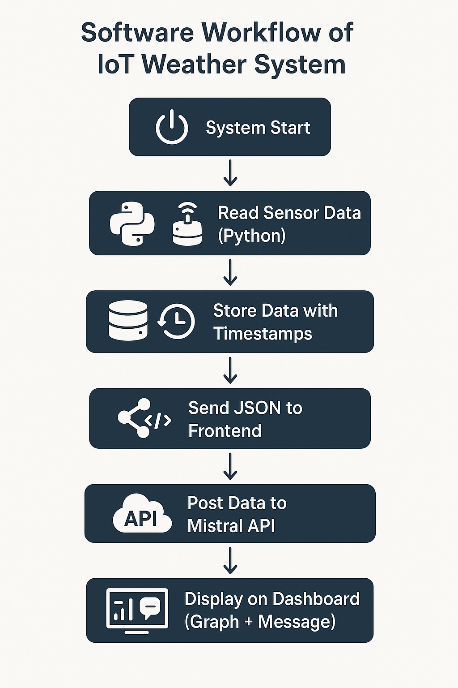

# Weather & Chat Dashboard 🌦️
### Real-time IoT Weather Monitoring & AI Assistant

<p align="center">
  
  
  
  
  
  
  
  
</p>

---

Weather & Chat Dashboard is a real-time IoT weather monitoring system designed for Raspberry Pi. It integrates a live DHT11 temperature and humidity sensor with an interactive chat interface powered by **Mistral AI**. Built using Google Antigravity and automated design-to-code pipelines, it offers a seamless blend of hardware telemetry and advanced cloud-based reasoning.

---

## 💻 Tech Stack

**Frontend & Visuals**
* **Languages:** HTML5, CSS3, JavaScript
* **Visualization:** Chart.js
* **Styling:** Custom Responsive Dark Theme

**Backend & Hardware Layer**
* **Framework:** Flask (Python)
* **Hardware Interface:** Adafruit CircuitPython DHT
* **Microcontroller:** Raspberry Pi (GPIO access)

**AI & Inference**
* **Core Engine:** Mistral AI API (Medium Model)
* **Use Case:** Natural Language Weather Intelligence

---

## 🌐 Distributed System Architecture & Connectivity

The Weather & Chat Dashboard is intentionally divided into specialized layers to ensure real-time hardware polling without blocking the interactive UI.

### System Diagram


```mermaid
graph TD
    %% Client Layer
    subgraph Client [Web Dashboard]
        A["Browser (HTML/JS)"]
        B["Chart.js Canvas"]
        C["Chat Interface"]
        A <--> B
        A <--> C
    end

    %% API Layer
    subgraph Backend [Flask Server]
        D["Flask API Router"]
        E["Data Aggregator (15s interval)"]
        F["Mistral AI Agent"]
        D <--> E
        D <--> F
    end

    %% Hardware Layer
    subgraph Hardware [IoT Layer]
        G["Raspberry Pi GPIO"]
        H["DHT11 Sensor"]
        G <--> H
    end

    %% Connections
    A <-->|REST/AJAX| D
    E <--> G
    F <-->|API Calls| I["Mistral API (Cloud)"]
```

### Why the Ecosystem Modules Exist Separately

**`Hardware Layer` — GPIO Polling**
Gathers local physical sensor metrics directly via Raspberry Pi pins. Operating this distinctly ensures precise timing without interrupting asynchronous web requests.

**`Backend` — Flask API Engine**
Acts as the bridge. It manages continuous 15-second sensor queries, limits the data array to the most recent 30 readings to manage memory, and securely proxies requests to the Mistral API.

**`Frontend` — Dynamic Web Canvas**
Renders real-time telemetry graphs and chat sequences using Chart.js. The UI remains highly responsive by asynchronously fetching updates without requiring full page reloads.

---

## 🔌 Hardware Setup & Diagrams

To deploy the physical sensors:
* A Raspberry Pi (any model with GPIO pins)
* DHT11 Temperature & Humidity Sensor connected to **GPIO4 (Pin 7)**
* Follow the [Adafruit DHT11 guide](https://learn.adafruit.com/dht) for detailed wiring.

<p align="center">
  
  
</p>
<p align="center">
  
  
</p>

---

## 🤖 Core Features & Pipeline

| Feature | Description |
|-------|-------------|
| **Live Sensor Telemetry** | 🌡️ Live temperature and humidity charts updated continuously every 15 seconds directly from the DHT11. |
| **Data Persistence** | 📈 Historical data table automatically retaining and displaying the most recent 30 sensor readings. |
| **AI Chat Assistant** | 💬 Interactive chat interface to ask complex weather-related queries, driven by Mistral's LLM. |
| **Responsive Dark UI** | 🌓 Beautiful, responsive dark-themed interface crafted with HTML, CSS, and Chart.js for optimal viewing. |

---

## 🛠️ Third-Party Integration Stack

| Service | Purpose |
|---------|---------|
| **Mistral AI** | Cloud-based LLM API utilized for processing and answering natural language weather queries. |
| **Chart.js** | Client-side charting library for rendering dynamic, animated sensor data visualization. |
| **Adafruit CircuitPython** | Python library designed for reading low-level signals from the DHT11 hardware via GPIO. |

---

## 🚀 Installation & Setup

> **Note:** The Raspberry Pi must have GPIO access and the required system-level libraries installed for the Adafruit package to function.

### 1. Clone the Repository
```bash
git clone https://github.com/JaleedAhmad/weather-chat-dashboard.git
cd weather-chat-dashboard
```

### 2. Virtual Environment (Recommended)
```bash
python3 -m venv venv
source venv/bin/activate
```

### 3. Install Dependencies
```bash
pip install -r requirements.txt
```

### 4. Configure Mistral API Key
In `app.py`, update the configuration block with your live credentials:
```python
MISTRAL_API_KEY = "your_api_key_here"
```

### 5. Launch the Application
```bash
python app.py
```
*Visit the app in your browser on the same network:*
`http://<raspberry-pi-ip>:5050`

---

## 📁 Project Directory Map

```text
weather-chat-dashboard/
├── app.py              # Flask API Entrypoint & Logic
├── requirements.txt    # Python Dependencies
├── README.md           # Documentation
├── static/
│   ├── script.js       # Chart.js & AJAX requests
│   └── style.css       # Dark-mode styling
├── templates/
│   └── index.html      # Main Dashboard View
└── diagrams/           # System & Hardware Diagrams
    ├── api_structure.png
    ├── hardware_circuit_diagram.png
    ├── hardware_workflow_weather_monitoring.png
    └── software_workflow_iot_system.png
```

---

## 👥 Author

**Jaleed Ahmad**
* Weather Monitoring & Chat Dashboard
* [@JaleedAhmad](https://github.com/JaleedAhmad)

*Feel free to open issues or contribute to the project!*

---

## 📄 License

<details>
<summary>MIT License — click to expand</summary>

```
MIT License

Copyright (c) 2025 Jaleed Ahmad

Permission is hereby granted, free of charge, to any person obtaining a copy
of this software and associated documentation files (the "Software"), to deal
in the Software without restriction, including without limitation the rights
to use, copy, modify, merge, publish, distribute, sublicense, and/or sell
copies of the Software, and to permit persons to whom the Software is
furnished to do so, subject to the following conditions:

The above copyright notice and this permission notice shall be included in all
copies or substantial portions of the Software.

THE SOFTWARE IS PROVIDED "AS IS", WITHOUT WARRANTY OF ANY KIND, EXPRESS OR
IMPLIED, INCLUDING BUT NOT LIMITED TO THE WARRANTIES OF MERCHANTABILITY,
FITNESS FOR A PARTICULAR PURPOSE AND NONINFRINGEMENT. IN NO EVENT SHALL THE
AUTHORS OR COPYRIGHT HOLDERS BE LIABLE FOR ANY CLAIM, DAMAGES OR OTHER
LIABILITY, WHETHER IN AN ACTION OF CONTRACT, TORT OR OTHERWISE, ARISING FROM,
OUT OF OR IN CONNECTION WITH THE SOFTWARE OR THE USE OR OTHER DEALINGS IN THE
SOFTWARE.
```

</details>
