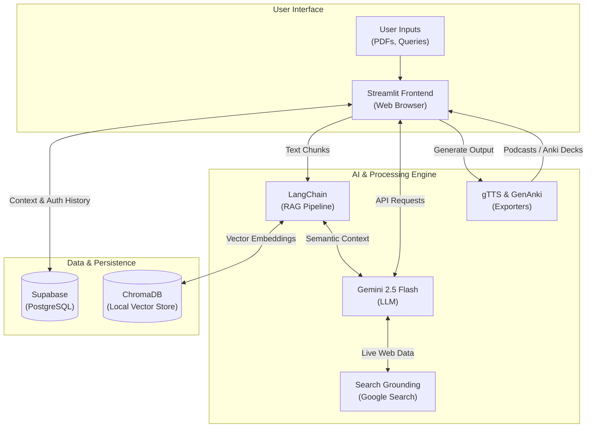

# AI Study Notes Agent 📚
### Enterprise-Grade Multi-User AI Study Assistant

<p align="center">
  
  
  
  
  
  
  
  
</p>

---

AI Study Notes Agent is an enterprise-grade, multi-user AI Study Assistant built locally on Python & Streamlit. This application drastically evolves from a minimal local PDF reader into a fully-fledged, cloud-native SaaS platform utilizing **Google's Gemini 2.5 Flash**, **RAG (Retrieval-Augmented Generation)**, **Search Grounding**, and **Supabase** to transform how users digest and interact with academic materials. Built using Google Antigravity and automated design-to-code pipelines.

---

## 📸 Interface Preview

*Showcasing the authentication flow, document pipeline, and dynamic generation options*

<p align="center">
  
  
  
</p>
*From left to right: Secure authentication, seamless multi-document uploads, and deep customization options.*

---

## 💻 Tech Stack

**Frontend & Core Framework**
* **Framework:** Streamlit
* **Language:** Python 3.10+
* **Audio Generation:** gTTS (Google Text-To-Speech)
* **Flashcard Compilation:** GenAnki

**Backend & Data Layer**
* **Relational Database & Auth:** Supabase (PostgreSQL)
* **Vector Database:** ChromaDB
* **Data Pipelines:** LangChain Text Splitters, PyPDF2
* **Security:** bcrypt, OAuth 2.0 (Google/GitHub)

**AI & Inference**
* **Core Reasoning Engine:** Google Gemini 2.5 Flash (`google-genai`)
* **Vector Embeddings:** `gemini-embedding-001`
* **Real-time Data Fetching:** Google Search Grounding API

---

## 🌐 Distributed System Architecture & Connectivity

The AI Study Notes Agent utilizes a local processing engine seamlessly connected to cloud-based persistence and state-of-the-art AI inference pipelines.

### System Diagram


```mermaid
graph TD
    %% Client Layer
    subgraph Client [User Interface]
        A["Streamlit Frontend \n (Web Browser)"]
        B["User Inputs \n (PDFs, Queries)"]
        B --> A
    end

    %% Cloud/Data Layer
    subgraph Data [Data & Persistence]
        C[("Supabase \n (PostgreSQL)")]
        D[("ChromaDB \n (Local Vector Store)")]
    end

    %% Inference/AI Layer
    subgraph Inference [AI & Processing Engine]
        E["Gemini 2.5 Flash \n (LLM)"]
        F["Search Grounding \n (Google Search)"]
        G["LangChain \n (RAG Pipeline)"]
        H["gTTS & GenAnki \n (Exporters)"]
    end

    %% Connections
    A <-->|Context & Auth History| C
    A -->|Text Chunks| G
    G <-->|Vector Embeddings| D
    G <-->|Semantic Context| E
    A <-->|API Requests| E
    E <-->|Live Web Data| F
    A -->|Generate Output| H
    H -->|Podcasts / Anki Decks| A
```

### Why the Ecosystem Modules Exist Separately

**`Frontend` — Streamlit UI Engine**
A dynamic, Python-driven user interface managing real-time chat interactions, PDF uploads, and complex layout configurations securely inside the user's browser without needing a complex JavaScript single-page application.

**`Data Layer` — Supabase & ChromaDB**
Supabase acts as the remote source of truth for user sessions, saving chat histories and document metadata seamlessly. ChromaDB runs locally alongside the process, acting as an ultra-fast vector indexer for real-time document semantic search.

**`Inference` — Google Gemini & Grounding**
Powers the intelligence of the application. Gemini 2.5 Flash acts as the orchestrator to synthesize study notes and converse with the user, while Google Search Grounding provides up-to-date internet knowledge dynamically injected into the chat context.

### How the Components Are Connected

**Data Flow & Client Actions:** The Streamlit frontend captures user inputs (PDFs, queries) and directly manages the session state, delegating storage tasks to Supabase for persistence.

**Real-Time Retrieval-Augmented Generation (RAG):** When a user queries a document, the LangChain pipeline chunks the text, queries the local ChromaDB for semantic matches using `gemini-embedding-001`, and pipes the context into the Gemini 2.5 Flash LLM.

**AI Inference Bridge:** The system dynamically routes prompts to Gemini 2.5 Flash, falling back to Google Search Grounding when real-time, external internet data is required to supplement the local document context.

---

## 🤖 Core Features & AI Pipeline Orchestration

The application utilizes a powerful Retrieval-Augmented Generation (RAG) pipeline to balance local document context with cloud-based reasoning:

| Feature | Description |
|-------|-------------|
| **Intelligent PDF Processing** | Upload any academic PDF to instantly generate tailored study notes. Customize output by **Tone** (Academic, Beginner), **Focus** (Flashcards, Code Examples), and **Length**. |
| **Full Library RAG Pipeline** | Uses `gemini-embedding-001` and **ChromaDB** to securely slice and embed chapters mathematically, allowing the AI to cite specific textbook pages instantly via Semantic Search. |
| **Interactive Q&A & Web Search 🌐** | Chat natively with the LLM about your textbooks. Live Web Search dynamically bridges Google's enterprise **Search Grounding APIs** into your chat, merging local context with real-time internet data. |
| **1-Click Anki Generator 🗃️** | AI extracts factual data from your notes, injecting pairs seamlessly into an SQLite database via `genanki`, handing you an `.apkg` file directly to import into Desktop Anki Software. |
| **Podcast Mode 🎧** | Seamlessly converts Markdown notes into an accessible spoken podcast natively in the browser leveraging `gTTS` (Google Text-To-Speech). |
| **Cloud DB & OAuth 2.0 ☁️** | Hooked dynamically to a remote **Supabase (PostgreSQL)** database. Saves every single chat session against your UUID. Log in via Email/Password, **Google**, or **Github** OAuth. |

---

## 🛠️ Third-Party Integration Stack & APIs Implemented

The architecture integrates deeply with Google's AI ecosystem and Supabase to deliver a seamless, cloud-native experience.

### 🔌 Real APIs Implemented

| Service | Purpose |
|---------|---------|
| **Supabase Authentication** | Handles user sessions via Email/Password, Google OAuth, and GitHub OAuth |
| **Supabase PostgreSQL** | Remote relational database storing user profiles, document metadata, and chat histories |
| **Google Gemini 2.5 Flash API** | Advanced cloud-based reasoning and synthesis for chat, note generation, and Anki extraction |
| **Google Search Grounding API** | Real-time web search capabilities injected into the LLM context |
| **ChromaDB** | Local vector store for high-speed semantic search over chunked PDF embeddings |
| **gTTS (Google Text-To-Speech)** | Audio generation pipeline for the Podcast Mode |

---

## 🚀 Installation & Setup

Ensure you have Python 3.10+ installed.

### 1. Clone & Virtual Environment
```bash
git clone https://github.com/your-username/ai-study-notes-agent.git
cd ai-study-notes-agent
python -m venv venv
source venv/bin/activate
```

### 2. Install Dependencies
```bash
pip install -r requirements.txt
```

### 3. Configure Environment Variables
Create a `.env` file inside the root folder matching this exact blueprint:

```env
# Google AI API Key
GEMINI_API_KEY=your_gemini_api_key

# Supabase Postgres Deployment
SUPABASE_URL=your_supabase_project_url
SUPABASE_KEY=your_supabase_anon_public_key

# Optional OAuth APIs
GOOGLE_CLIENT_ID=your_google_oauth_client_id
GOOGLE_CLIENT_SECRET=your_google_oauth_secret
GITHUB_CLIENT_ID=your_github_oauth_client_id
GITHUB_CLIENT_SECRET=your_github_oauth_secret
```

### 4. Initialize Supabase Datastore
You must execute this SQL block in your Supabase SQL Editor:
```sql
CREATE TABLE users (
  id UUID PRIMARY KEY DEFAULT uuid_generate_v4(),
  email TEXT UNIQUE NOT NULL,
  password_hash TEXT,
  provider TEXT DEFAULT 'email',
  created_at TIMESTAMP WITH TIME ZONE DEFAULT NOW()
);

CREATE TABLE sessions (
  id UUID PRIMARY KEY DEFAULT uuid_generate_v4(),
  user_id UUID REFERENCES users(id) ON DELETE CASCADE,
  filename TEXT NOT NULL,
  pdf_text TEXT,
  notes TEXT,
  chat_history JSONB DEFAULT '[]'::jsonb,
  timestamp TIMESTAMP WITH TIME ZONE DEFAULT NOW()
);

ALTER TABLE users DISABLE ROW LEVEL SECURITY;
ALTER TABLE sessions DISABLE ROW LEVEL SECURITY;
```

### 5. Launch Application
```bash
source venv/bin/activate  # (Use .\venv\Scripts\activate on Windows)
streamlit run app.py
```

---

## 📁 Project Directory Map

```text
ai-study-notes-agent/
├── app.py              # Main Entry Point (Streamlit)
├── requirements.txt    # Python Dependencies
├── .env                # Secret Keys (Not tracked)
├── src/
│   ├── core/           # Agent Logic, RAG, Prompts
│   ├── database/       # Supabase Client & Operations
│   ├── auth/           # OAuth 2.0 (Google/GitHub)
│   ├── ui/             # Modular Streamlit UI Components
│   ├── exporters/      # PDF, Anki, & Audio Generation
│   └── utils/          # PDF Reader & Utility Helpers
└── tests/              # Test Scripts & Debug Utilities
```

---

<p align="center">Built with ❤️ for intelligent, local-first learning dynamics.</p>

---

## 📄 License

<details>
<summary>MIT License — click to expand</summary>

```
MIT License

Copyright (c) 2025 AI Study Notes Agent

Permission is hereby granted, free of charge, to any person obtaining a copy
of this software and associated documentation files (the "Software"), to deal
in the Software without restriction, including without limitation the rights
to use, copy, modify, merge, publish, distribute, sublicense, and/or sell
copies of the Software, and to permit persons to whom the Software is
furnished to do so, subject to the following conditions:

The above copyright notice and this permission notice shall be included in all
copies or substantial portions of the Software.

THE SOFTWARE IS PROVIDED "AS IS", WITHOUT WARRANTY OF ANY KIND, EXPRESS OR
IMPLIED, INCLUDING BUT NOT LIMITED TO THE WARRANTIES OF MERCHANTABILITY,
FITNESS FOR A PARTICULAR PURPOSE AND NONINFRINGEMENT. IN NO EVENT SHALL THE
AUTHORS OR COPYRIGHT HOLDERS BE LIABLE FOR ANY CLAIM, DAMAGES OR OTHER
LIABILITY, WHETHER IN AN ACTION OF CONTRACT, TORT OR OTHERWISE, ARISING FROM,
OUT OF OR IN CONNECTION WITH THE SOFTWARE OR THE USE OR OTHER DEALINGS IN THE
SOFTWARE.
```

</details>
